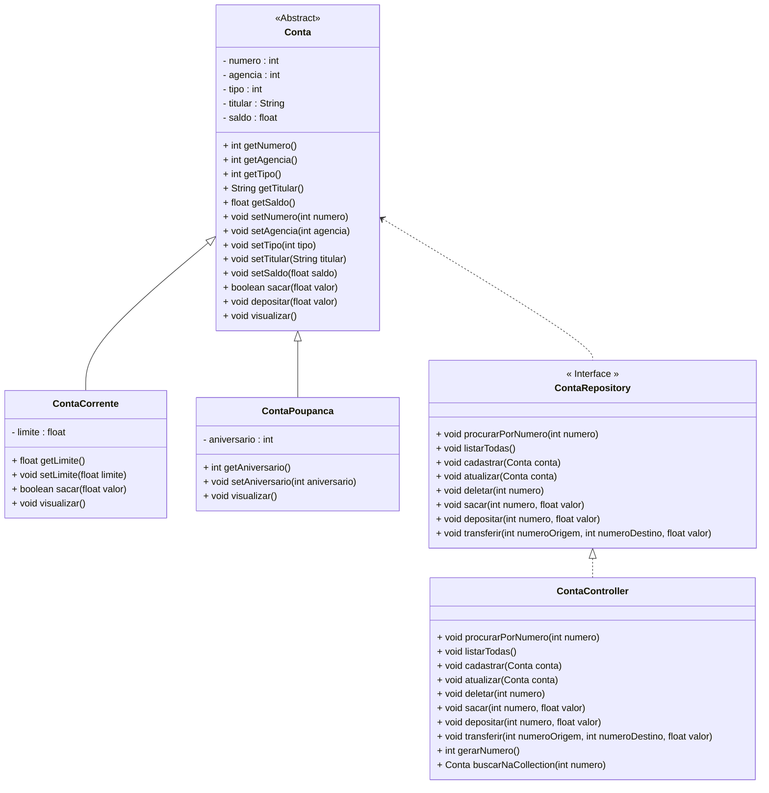

<h1 text-align: center>Projeto 01 - Conta Bancária - Iniciando o Projeto Java</h1>

Projeto Conta Bancária foi o Projeto Guia no Bootcamp Generation para o aprendizado dos Conceitos e aplicação da Orientação a Objetos. Todo o código que implementamos no projeto Conta Bancária serviu de base para a construção do Projeto Java, que marca o final do primeiro modulo. Veja o Diagrama de Classes do Projeto Conta Bancária completo na figura abaixo:

